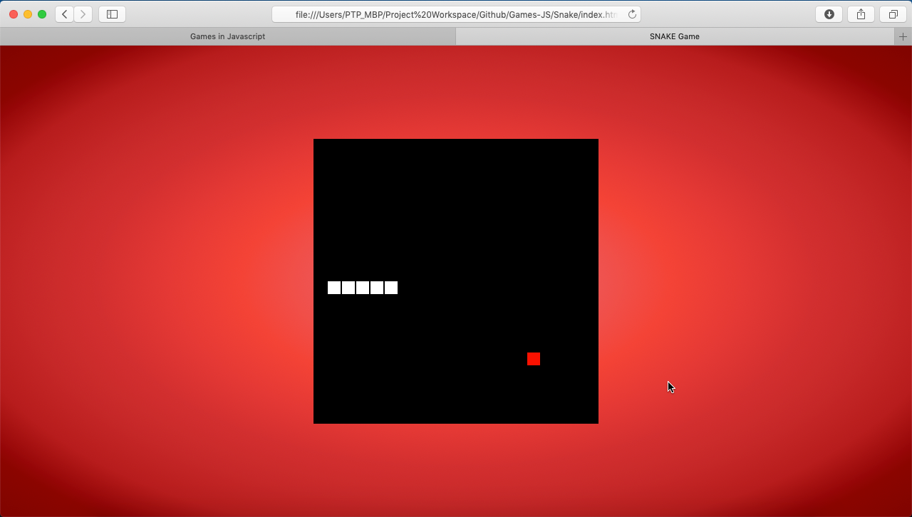
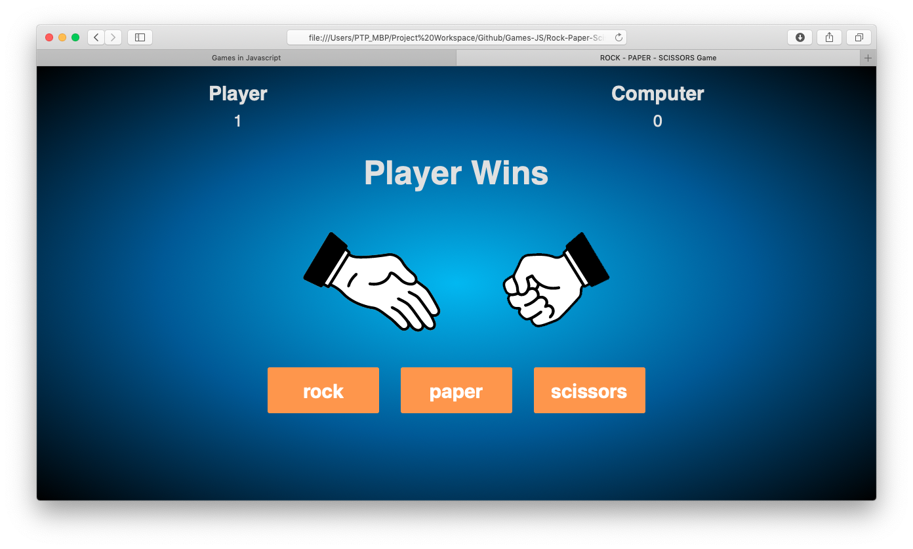
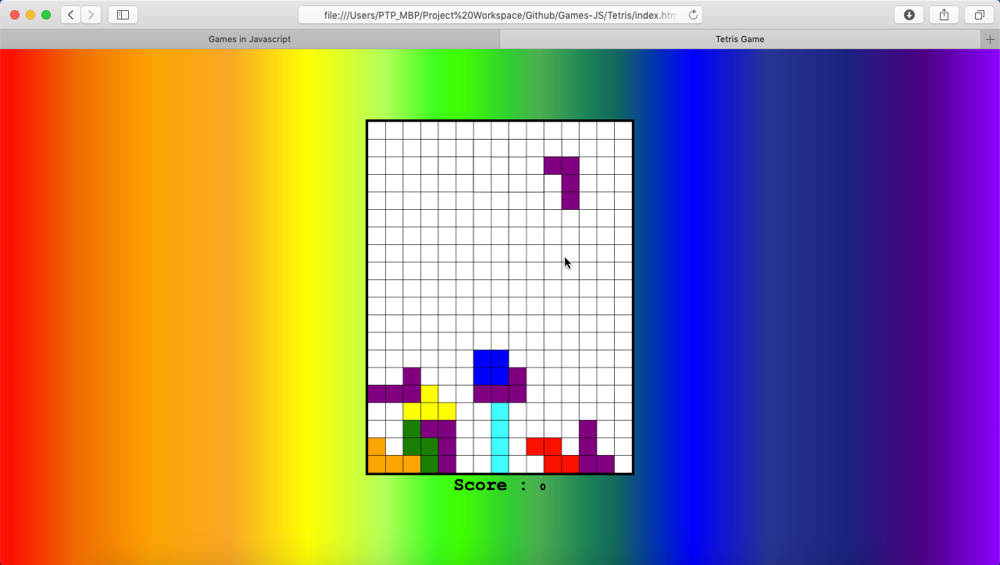
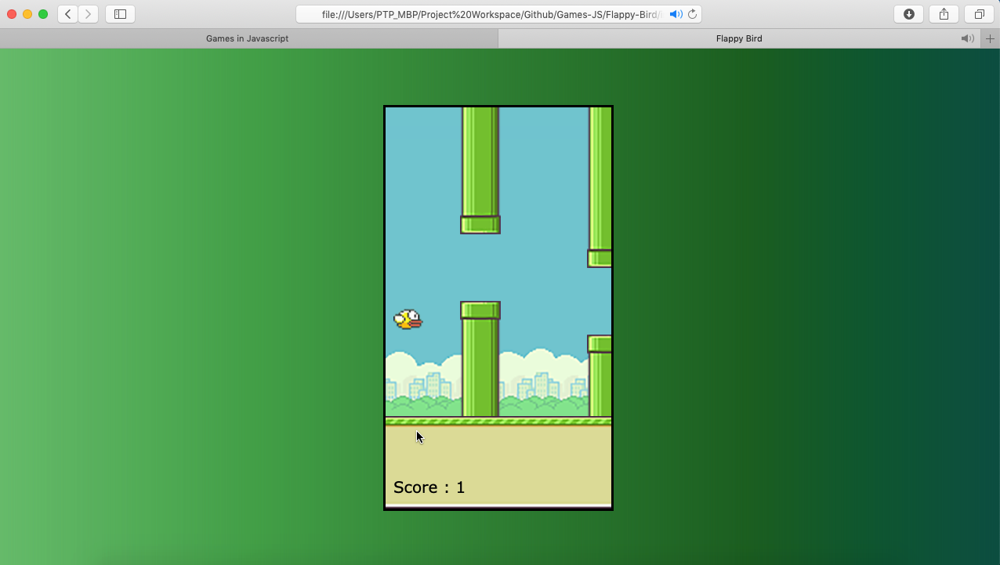

# Javascript Games
### Implementation of various popular games using plain Javascript.

There are currently six games available -
1. Snake
2. Rock-Paper-Scissor
3. Ping-Pong
4. Tetris
5. Flappy Bird
6. Brick Breaker

### Games : 

#### 1. Snake 
* Single player game.
* Uses HTML canvas.
* Uses keyboard buttons - left, right, up, down arrow keys - for controlling the movement of the snake.

#### 2. Rock-Paper-Scissor
* Player vs. Computer game.
* Implemented basic animations for hands.

#### 3. Ping-Pong
* Player vs. Computer game.
* Uses HTML canvas.
* Implemented sound effects.

#### 4. Tetris
* Single player game.
* Uses HTML canvas.
* Uses keyboard buttons - left, right, up, down arrow keys - for controlling the placement of the objects.

#### 5. Flappy Bird
* Single player game.
* Uses HTML canvas.
* Uses keyboard buttons for controlling the bird.

#### 6. Brick Breaker
* Single player game.
* Uses HTML canvas.
* Added sound effects.
* Uses keyboard buttons - left arrow key and right arrow key - for controlling the paddle.

### References :
- [Chris DeLeon's course on Game Development on Udemy](https://www.udemy.com/code-your-first-game/)
- [Chris DeLeon's youtube tutorial](https://youtu.be/xGmXxpIj6vs)
- [Code Explained's youtube channel](https://www.youtube.com/channel/UC8n8ftV94ZU_DJLOLtrpORA/featured)
